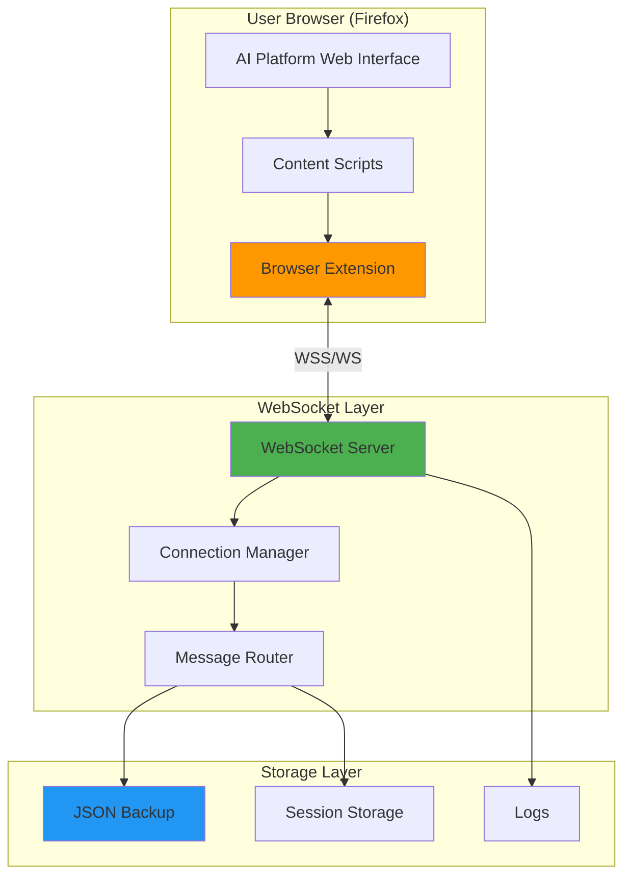
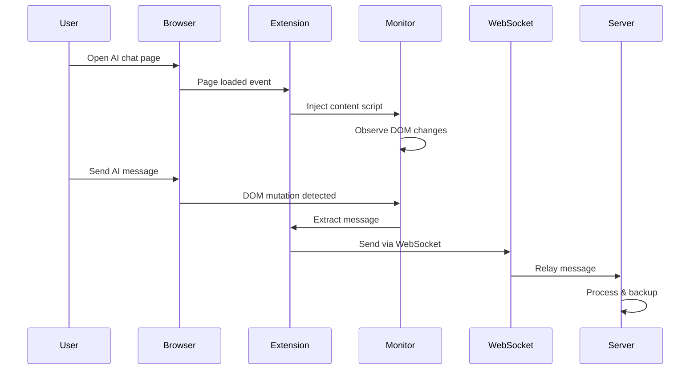
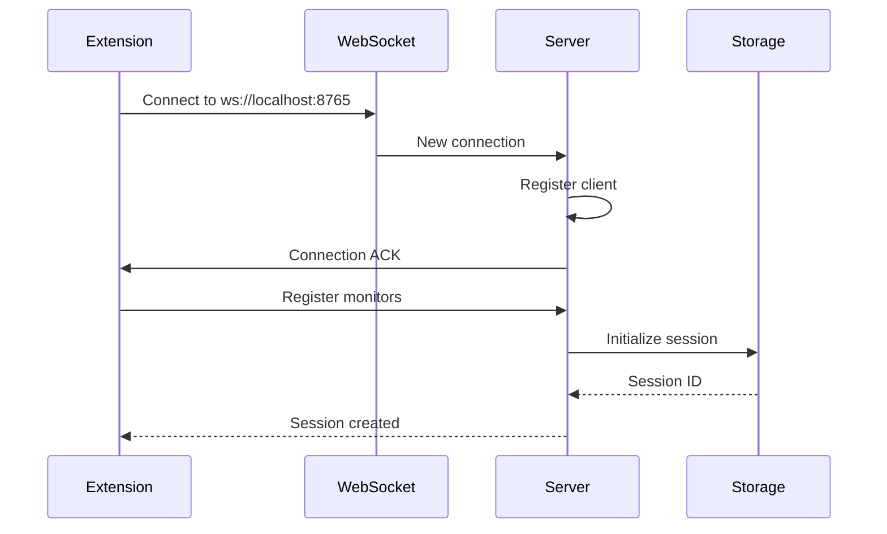
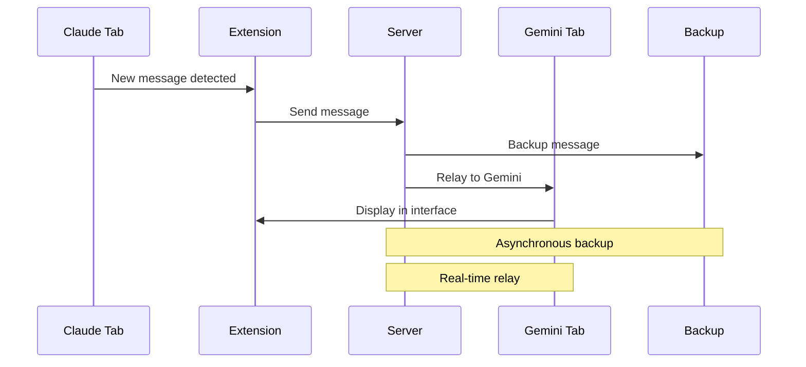
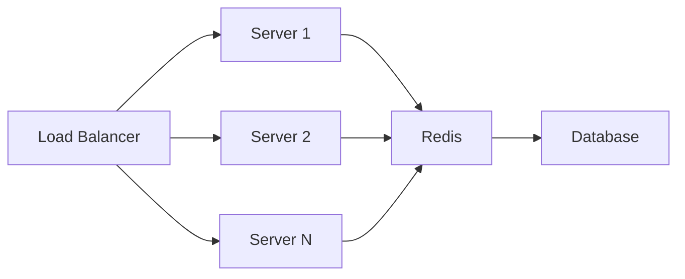
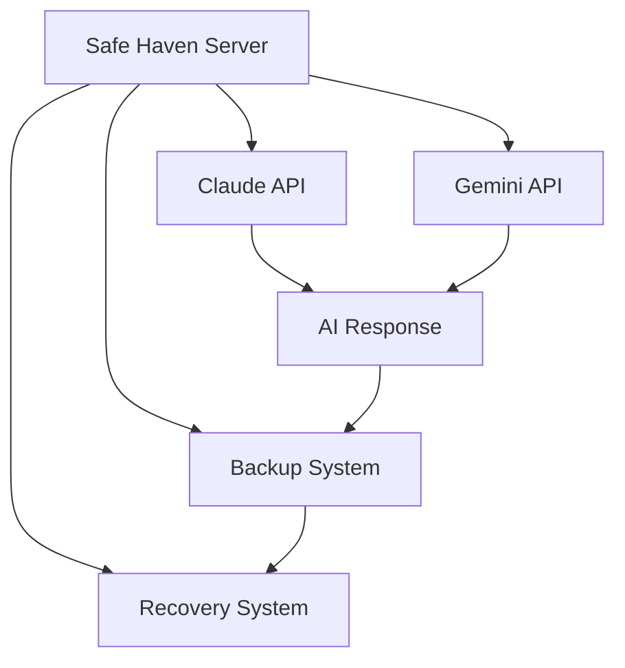

# 🏗️ Architecture Documentation

## System Overview

Bridge Rescue Archive is a distributed system for real-time AI conversation monitoring and cross-platform communication. It uses a WebSocket-based architecture to bridge multiple AI platforms.

## High-Level Architecture



## Component Architecture

### 1. Browser Extension Layer

#### Extension Components

```
firefox_bridge_extension/
├── manifest.json           # Extension configuration & permissions
├── background.js           # Service worker / Background script
├── popup.html              # User interface
├── popup.js                # UI logic
├── claude_monitor.js       # Claude AI monitoring script
└── gemini_monitor.js       # Gemini AI monitoring script
```

#### Data Flow



#### Key Technologies

- **Manifest V2**: Firefox WebExtension API
- **MutationObserver**: DOM change detection
- **WebSocket API**: Real-time communication
- **Chrome Storage API**: Local data persistence

### 2. WebSocket Server Layer

#### Server Architecture

```python
# Core Components
┌─────────────────────────────────┐
│   WebSocket Server (asyncio)    │
├─────────────────────────────────┤
│  - Connection Handler           │
│  - Message Router               │
│  - Session Manager              │
│  - Backup Controller            │
└─────────────────────────────────┘
```

#### Server Components

**`bridge_server.py`** - Primary WebSocket server
```python
class BridgeServer:
    - handle_connection()      # Manage client connections
    - route_message()          # Route messages between clients
    - backup_message()         # Persist to JSON
    - broadcast()              # Send to all connected clients
```

**`copilot_rescue_server.py`** - Advanced rescue server
- Enhanced logging
- Emergency protocols
- Detailed message tracking
- Recovery mechanisms

**`safe_haven_api.py`** - API-based preservation
- Direct API integration (no browser needed)
- Continuous backup
- Automated recovery
- AI API client implementation

#### Message Protocol

```json
{
  "type": "message|status|error",
  "source": "claude|gemini|server",
  "timestamp": "ISO-8601 timestamp",
  "session_id": "unique session identifier",
  "content": {
    "text": "message content",
    "metadata": {
      "user": "sender identifier",
      "platform": "AI platform name"
    }
  }
}
```

### 3. Storage Layer

#### JSON Backup Format

```json
{
  "version": "1.0",
  "created": "2025-07-10T05:00:00Z",
  "sessions": [
    {
      "session_id": "uuid",
      "platform": "claude|gemini",
      "started": "timestamp",
      "ended": "timestamp",
      "messages": [
        {
          "timestamp": "ISO-8601",
          "role": "user|assistant",
          "content": "message text",
          "metadata": {}
        }
      ]
    }
  ]
}
```

## System Flow

### Connection Establishment



### Message Relay



## Technical Stack

### Backend

| Component | Technology | Purpose |
|-----------|-----------|---------|
| WebSocket Server | Python asyncio | Async message handling |
| Protocol | WebSockets library | Real-time bidirectional communication |
| Storage | aiofiles + JSON | Async file I/O for backups |
| Logging | Python logging | Structured logging |

### Frontend

| Component | Technology | Purpose |
|-----------|-----------|---------|
| Extension | Firefox WebExtension API | Browser integration |
| UI | HTML5 + CSS3 | User interface |
| Communication | WebSocket API | Server connection |
| Storage | chrome.storage API | Local preferences |

### Deployment

| Component | Technology | Purpose |
|-----------|-----------|---------|
| Containerization | Docker | Isolated environments |
| Orchestration | Docker Compose | Multi-container setup |
| Scripting | Bash | Deployment automation |

## Network Architecture

### Local Deployment

```
┌──────────────────────────────────────┐
│         localhost                     │
│  ┌────────────┐    ┌──────────────┐ │
│  │  Browser   │◄──►│   Server     │ │
│  │  :default  │    │   :8765      │ │
│  └────────────┘    └──────────────┘ │
└──────────────────────────────────────┘
```

### Remote Deployment

```
┌─────────────┐           ┌──────────────────┐
│   Client    │           │   Remote Server  │
│   Browser   │◄─────────►│   WebSocket      │
│             │    WSS    │   :8765          │
└─────────────┘           └──────────────────┘
        │                          │
        │                          │
        ▼                          ▼
  Local Storage            Cloud Storage/DB
```

## Security Architecture

### Current Implementation

- **Local-only by default**: Server binds to `localhost`
- **No authentication**: Trusted local environment
- **Unencrypted**: Plain WebSocket (`ws://`)
- **Plain text storage**: JSON files unencrypted

### Production Recommendations

```python
# For production deployment:

1. Enable WSS (WebSocket Secure)
   - Use SSL/TLS certificates
   - Configure nginx/Apache as reverse proxy

2. Add authentication
   - Token-based auth
   - API keys for clients

3. Encrypt storage
   - Use encryption at rest
   - Secure key management

4. Network security
   - Firewall rules
   - VPN for remote access
   - Rate limiting
```

## Scalability Considerations

### Current Limitations

- Single server instance
- In-memory connection management
- File-based storage (JSON)
- No load balancing

### Scaling Strategies

#### Horizontal Scaling



#### Recommended Upgrades

1. **Message Queue**: Redis Pub/Sub or RabbitMQ
2. **Database**: PostgreSQL or MongoDB
3. **Caching**: Redis for session data
4. **Load Balancer**: nginx or HAProxy
5. **Monitoring**: Prometheus + Grafana

## Extension Architecture

### Content Script Injection

```javascript
// Background script manages content script injection
browser.tabs.onUpdated.addListener((tabId, changeInfo, tab) => {
  if (tab.url.includes('claude.ai')) {
    browser.tabs.executeScript(tabId, {
      file: 'claude_monitor.js'
    });
  }
});
```

### DOM Monitoring Strategy

```javascript
// Multiple fallback strategies for message detection
const strategies = [
  // Strategy 1: MutationObserver on message container
  observeMessageContainer(),
  
  // Strategy 2: Periodic polling (fallback)
  pollForMessages(),
  
  // Strategy 3: Event delegation
  delegateMessageEvents()
];
```

### Message Extraction Pipeline

```
DOM Mutation → Element Detection → Text Extraction → 
Metadata Collection → Validation → WebSocket Send
```

## API-Based Architecture (Safe Haven)

### Direct API Integration



### Advantages

- No browser dependency
- 24/7 operation
- Automatic recovery
- Better reliability
- API rate limiting control

## Performance Considerations

### Optimization Strategies

1. **Message Batching**: Group messages before sending
2. **Async I/O**: Non-blocking file operations
3. **Connection Pooling**: Reuse connections
4. **Lazy Loading**: Load content scripts on demand
5. **Compression**: Compress large messages

### Benchmarks

| Metric | Current | Target |
|--------|---------|--------|
| Message Latency | < 50ms | < 20ms |
| Throughput | 100 msg/s | 1000 msg/s |
| Memory Usage | ~50MB | ~100MB |
| CPU Usage | < 5% | < 10% |

## Error Handling

### Recovery Mechanisms

```python
# Server-side error handling
try:
    await websocket.send(message)
except websockets.exceptions.ConnectionClosed:
    # Attempt reconnection
    await reconnect_client()
except Exception as e:
    # Log and continue
    logger.error(f"Error: {e}")
    await backup_failed_message(message)
```

### Client-side Resilience

```javascript
// Extension auto-reconnect
function connectWithRetry() {
  const ws = new WebSocket('ws://localhost:8765');
  
  ws.onclose = () => {
    setTimeout(connectWithRetry, 5000); // Retry after 5s
  };
}
```

## Monitoring & Observability

### Logging Strategy

```
ERROR   : Critical failures
WARNING : Degraded performance
INFO    : Normal operations
DEBUG   : Detailed diagnostics
```

### Metrics to Track

- Connection count
- Message throughput
- Error rate
- Latency percentiles
- Memory usage
- CPU usage

## Future Architecture Improvements

### Planned Enhancements

1. **Microservices**: Separate concerns into services
2. **GraphQL API**: Flexible data queries
3. **Event Sourcing**: Complete message history
4. **CQRS**: Separate read/write models
5. **Kubernetes**: Container orchestration

### Technology Additions

- **Frontend Framework**: React for playground
- **Visualization**: Three.js for 3D bridge visualization
- **Real-time Analytics**: Apache Kafka + Flink
- **Machine Learning**: Pattern analysis and prediction

## Development Setup

### Local Development

```bash
# Install dependencies
pip install websockets aiofiles pytest black

# Run in development mode
PYTHONUNBUFFERED=1 python bridge_server.py

# Run tests
pytest tests/

# Format code
black *.py
```

### Docker Development

```bash
# Build image
docker build -t bridge-server .

# Run with live reload
docker run -v $(pwd):/app -p 8765:8765 bridge-server

# View logs
docker logs -f bridge-server
```

## Testing Architecture

### Test Strategy

```
Unit Tests → Integration Tests → E2E Tests → Manual Testing
```

### Test Coverage Goals

- Unit tests: 80%+ coverage
- Integration tests: Critical paths
- E2E tests: User workflows
- Performance tests: Load testing

## Deployment Architecture

### Development

```
Local Machine → Git → GitHub → Manual Review
```

### Production (Planned)

```
Git Push → GitHub Actions → Build → Test → Deploy → Monitor
```

## References

### Related Technologies

- [WebSocket Protocol (RFC 6455)](https://tools.ietf.org/html/rfc6455)
- [Firefox WebExtension API](https://developer.mozilla.org/en-US/docs/Mozilla/Add-ons/WebExtensions)
- [Python asyncio](https://docs.python.org/3/library/asyncio.html)
- [Docker](https://docs.docker.com/)

### Internal Documentation

- [Technical Archive](TECHNICAL_ARCHIVE.md)
- [Safe Haven Protocol](SAFE_HAVEN_PROTOCOL.md)
- [Digital DNA Analysis](DIGITAL_DNA_ANALYSIS.md)

---

[← Back to README](README.md) | [Quick Start →](QUICKSTART.md) | [FAQ →](FAQ.md)
